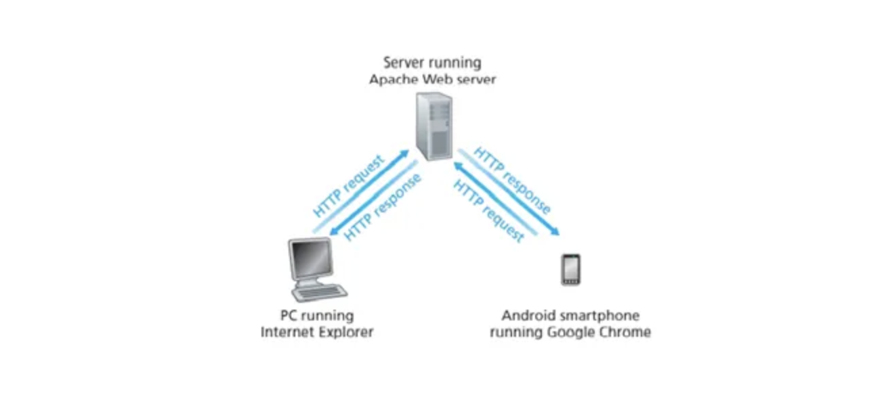
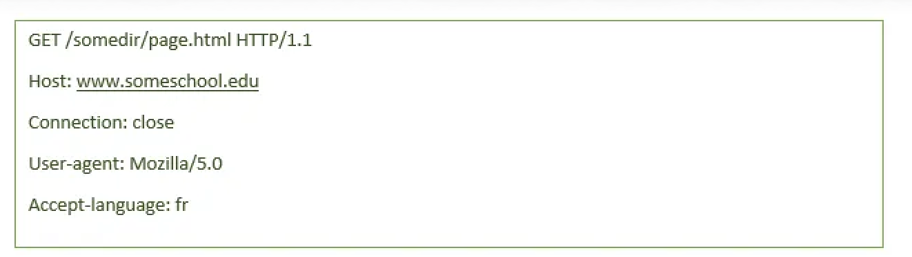
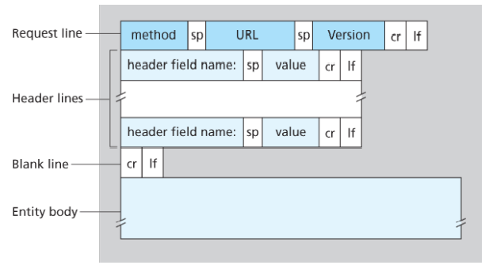
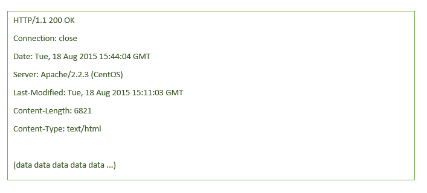
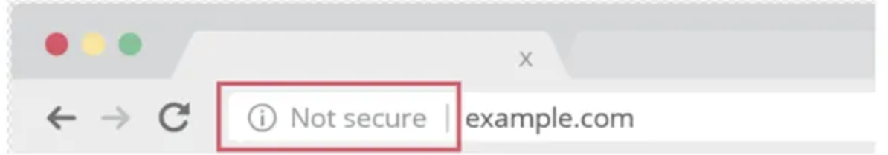
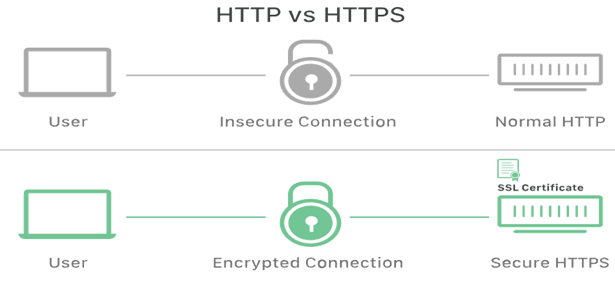

## HTTP, HTTPS, SSL/TLS,SSH

### Web ve HTTP

1990'ların başına kadar İnternet öncelikle araştırmacılar, akademisyenler ve üniversite öğrencileri tarafından kullanılıyordu. uzak ana bilgisayarlarda oturum açmak, yerel ana bilgisayarlardan uzak ana bilgisayarlara dosya aktarmak ve bunun tam tersi için, haber göndermek ve almak, elektronik posta almak ve göndermek için kullanılıyordu.Ta ki WWW (Wordl Wide Web) sahneye çıkana kadar. Web, halkın dikkatini çeken ilk İnternet uygulamasıydı. İnsanların çalışma ortamlarının içinde ve dışında nasıl etkileşime girdiğini önemli ölçüde değiştirdi ve değiştirmeye devam ediyor. Belki de kullanıcılara en çok hitap eden şey, Web'in talep üzerine çalışmasıdır. Kullanıcılar istedikleri zaman istedikleri şeyleri alırlar.bu Tv ve Radyo yayınlarının tam tersidir.Web herkesi bir yayıncı hale getirdi.Arama motorları web okyanusunda gezinmemizi sağladı. Formlar, JavaScript, Java uygulamaları ve diğer birçok cihaz sayfalar ve sitelerle etkileşim kurmamızı sağlar. Ve Web protokolleri, YouTube, Web tabanlı e-posta (Gmail gibi) ve çoğu mobil İnternet uygulaması, Instagram ve Google Haritalar için bir platform görevi görür.

### HTTP'ye genel bakış

Hyper Text Transfer Protokol(HTTP) web'in uygulama katmanında 80 port numarası ile çalışan bir prokoldür. Web'in kalbi diyebiliriz. Http 2 programda uygulanır: istemci(client) programı ve sunucu(server) programı. Server ve Client, uç sistemleri çalıştırarak, http mesajlarını birbirleri ile değiştirerek mesajlaşırlar. Bu mesajların yapısı HTTP tarafından tanımlanır. HTTP'nin detaylarına inmeden önce bazı web terminolojini inceleyelim. Bir Web sayfası (document de denebilir) object (nesne) lerden oluşur.Bir objectkısaca html, jpeg video-clip vb- kısaca single URL ile adreslenebilir bir dosyadır.

Çoğunlukla web sayfası temel bir HTML dosyasıdan ve birçok farklı objecten oluşur. Örnek olarak bir Web sayfasında 1 html 5 tane jpeg dosyası var ise bu web sayfasında toplamada 6 tane object vardır. Temel HTML dosyası, nesnelerin URL'leri ile sayfadaki diğer nesnelere başvurur.Her URL in 2 tane bileşeni vardır: hostname ve pathname. Örnek olarak: http://www.someSchool.edu/someDepartment/picture.gif Bu URL www.someSchool.edu hostname , /someDepartment/picture.gif ise pathnamedir.Web Browserlar HTTP'nin Client tarafını uygularken, Web Serverlar Server Tarafını uygular. HTTP, Web clientların Web serverından Web sayfalarını nasıl talep ettiğini ve serverların Web sayfalarını clientlara nasıl aktardığını tanımlar. Client bir Request te bulunduğunda (bir linke tıklarsa mesela) Browser, sayfadaki objectler için server a HTTP Request mesajı gönderir. Server, request mesajını aldığında bu mesaj için browser a http response ile response mesajı gönderir.

HTTP, temel aktarım protokolü olarak TCP'yi kullanır. HTTP client i önce server ile bir TCP bağlantısı başlatır. Bağlantı kurulduğunda, browser ve server işlemleri TCP'ye kendi soket arayüzleri üzerinden erişim sağlar. Client tarafında, soket arabirimi, istemci işlemi ile TCP bağlantısı arasındaki kapıdır; server tarafında ise sunucu işlemi ile TCP bağlantısı arasındaki kapıdır. Client, HTTP istek mesajlarını soket arayüzüne gönderir ve HTTP yanıt mesajlarını soket arayüzünden alır.



Benzer şekilde, HTTP server soket arayüzünden istek mesajları alır ve soket arayüzüne cevap mesajları gönderir. İstemci soket arayüzüne bir mesaj gönderdiğinde, mesaj artık clientın elinden çıkmış TCP'nin eline geçmiştir. TCP, HTTP'ye güvenilir bir veri aktarım hizmeti sağlar. Bu, şu anlama gelir: bir client işlemi tarafından gönderilen her HTTP istek mesajı, sonunda servera bozulmadan ulaşır; benzer şekilde, server işlemi tarafından gönderilen her HTTP yanıt mesajı, sonunda clienta eksiksiz olarak ulaşır. Burada katmanlı mimarini büyük bir avantajını görüyoruz. HTTP, datada oluşacak kayıp ile ilgilenmez, bu iş TCP tarafından gerçekleştirilir.

### HTTP mesaj formatları

Response message ve Request message olmak üzere 2 farklı mesaj formatı vardır



*HTTP Request Message yapısı*

Öncelikle mesajın sıradan ASCII metninde yazıldığını görüyoruz, Sırdan bir bilgisayar okur yazarı bile bunu okuyabilir. İkinci olarak, mesajın her biri bir satır başı ve bir satır içeriği olarak birbirini takipeden beş satırdan oluştuğunu görüyoruz.Bu request mesajı 5 satrıdan oluşuyor ama daha fazla mesajdanda oluşabilir.

HTTP request mesajını ilk satırı request satırı olarak adlandırılır.Sonraki satırlar ise Header Satırları olarak adlandırılır. Request satırı 3 alandan oluşur: Method alanı, URL alanı ve HTTP versiyon alanı.

Method alanı GET,POST,PUT,DELETE,HEAD gibi değerler alabilir. En çok kullanılan GET ve POST tur. GET browser bir object için requestte bulunduğunda kullanılır.

- PUT: Sunucudaki bir kaynağı güncellemek için kullanılır. Bu istekler de genellikle üzerilerinde değiştirilmek istenen bilgiyi taşırlar.
- PATCH: Bu metot da sunucudaki bir kaynağı değiştirmek için kullanılır. Put ile arasındaki fark ise Put sunucudaki kaynağı yeni bir kaynak ile değiştirmek için kullanılır iken, Patch bu kaynağında bir kısmını değiştirmeye yarar.
- DELETE: Sunucudaki bir kaynağı silmeye yarar.

Daha az kullanılan metotlar ise aşağıdaki gibidir:

- CONNECT: Sunucu ile bir bağlantı oluşturma isteği gönderir. Sunucu bağlantılarını minimum yük ile test etme olanağı sağlar.
- HEAD : Sunucuya aynı Get metodu gibi ancak sadece başlığı olan (Request Header), gövdesi olmayan(Request Body) bir istek gönderir. Genellikle sunucuda bir kaynak mevcut mu veya kaynağın en son güncellenme bilgisi için kullanılır.
- OPTİONS: Sunucunun desteklediği metotları kontrol etmek için kullanılır.
- TRACE: Bu metod ile bir sunucuya istek gönderdiğinizde, aradaki tüm vekil sunucular (Proxy, Gateway) isteğin başlığına kendi IP veya DNS biglilerini eklerler. Genellikle hata ayıklama/bakım işleri için kullanılır.

Yukarıdaki örnek requestte bulunulan object /somedir/page.html dir. Bu örnekte browser HTTP/1.1 versiyonunu kullanıyor.

**Header satırları;**

- Host: www.someschool.edu: Objectin bulunduğu hostu belirtir.
- connection: close : Browser, sunucuya kalıcı bağlantılarla uğraşmak istemediğini söylüyor; istenen nesneyi gönderdikten sonra sunucunun bağlantıyı kapatmasını ister.
- User-Agent: Sunucuya istekte bulunan Browser türünü belirtir. Burada user-agent bir Firefox browserı olan Mozilla/5.0'dır. Bu Header satırı faydalıdır çünkü server aslında aynı objectin farklı sürümlerini farklı türde user-agentlerına gönderebilir.
- Accept-language: başlık, sunucuda böyle bir nesne varsa, kullanıcının nesnenin Fransızca bir sürümünü almayı tercih ettiğini belirtir; aksi takdirde, sunucu varsayılan sürümünü göndermelidir.

Yukarıdaki örneği inceledikten sonra şimdi http requestin genel formatına bakalım.

ancak, başlık satırlarından (ve ek satır başı ve satır beslemesinden) sonra bir "entity body" vardır. Entity body, GET yöntemiyle boştur, ancak POST yöntemiyle kullanılır. Bir HTTP clientı, kullanıcı bir formu doldurduğunda (örneğin, bir kullanıcı bir arama motoruna arama sözcükleri yazdığında) genellikle POST yöntemini kullanır. Bir POST mesajıyla, kullanıcı hala bir serverdaki Web sayfasına istekte bulunuyor. Ancak Web sayfasının belirli içeriği kullanıcının form alanıne ne girdiğine bağlı. Eğer method değeri POST ise entitiy body kullanıcının girmiş olduğu değereleri barındırır.



HTML formları genellikle GET yöntemini kullanır ve girilen verileri (form alanlarında) istenen URL'ye dahil eder. Örneğin, bir form GET yöntemini kullanıyorsa, iki tane alana sahipse ve iki alana girişler monkeys ve bananas ise, URL şöyle bir yapıya sahip olacaktır. www.somesite.com/animalsearch?monkeys&bananas.

Şimdi HTTP Response mesajını inceleyelim.



Durum satırında 3 farklı bölüm görüyoruz. 6 tane Header satırı ve son olarak entitiy body yi görüyoruz. Durum satırında üç alan vardır: protokol sürüm alanı, durum kodu ve ilgili durum mesajı.

Bu örnekte durum satırı, sunucunun HTTP/1.1 kullandığını ve her şeyin yolunda olduğunu (yani, sunucunun istenen nesneyi bulduğunu ve gönderdiğini) gösterir.

**Header satırlarına bir göz atalım.**

- Connection:close : Server burada clinet'a mesajı gönderdikten sonra TCP bağlantısını kapatacağını söylüyor.
- Date: HTTP yanıtının oluşturulduğu ve sunucu tarafından gönderildiği saati ve tarihi gösterir. unutmayın ki bu nesnenin oluşturulduğu veya en son değiştirildiği zaman değildir; serverın nesneyi dosya sisteminden aldığı, nesneyi yanıt mesajına eklediği ve yanıt mesajını gönderdiği zamandır.
- The Server: Mesajın bir Apache Web tarafından oluşturulduğunu gösterir sunucu; HTTP request mesajındaki User-agent başlık satırına benzer.
- Last-Modified: Üstbilgisi, nesne önbelleğe alma için kritiktir, hem yerel istemci ve ağ önbellek sunucularında (proxy sunucuları olarak da bilinir).
- Content-Length: başlık satırı, gönderilen nesnedeki bayt sayısını gösterir.
- Content-Type: başlık satırı, varlık gövdesindeki nesnenin HTML metni olduğunu gösterir.

### HTTP durum kodları

- 1xx Bilgilendirici
- 2xx Başarı
- 3xx Yönlendirme
- 4xx İstemci Hatası
- 5xx Sunucu Hatası olduklarını temsil ederler. xx burada 00–99 arasında sayılardır.

En çok karşılaşılan kodlar aşağıdaki gibidir.

- HTTP Status Code 200 — OK.
- HTTP Status Code 301 — Permanent Redirect.
- HTTP Status Code 302 — Temporary Redirect.
- HTTP Status Code 404 — Not Found.
- HTTP Status Code 410 — Gone.
- HTTP Status Code 500 — Internal Server Error.
- HTTP Status Code 503 — Service Unavailable.

### HTTPS

Hypertext transfer protocol secure (HTTPS) bir web tarayıcısı ile bir web sitesi arasında veri göndermek için kullanılan birincil protokol olan HTTP'nin güvenli sürümüdür. Veri aktarımının güvenliğini artırmak için HTTPS şifrelenir. Bu, özellikle kullanıcılar bir banka hesabına, e-posta hizmetine veya sağlık sigortası sağlayıcısına giriş yapmak gibi hassas verileri iletirken önemlidir.

Herhangi bir web sitesi, özellikle oturum açma kimlik bilgileri gerektirenler, HTTPS kullanmalıdır. Chrome gibi modern web tarayıcılarında, HTTPS kullanmayan web siteleri, diğerlerinden farklı olarak işaretlenir. Web sayfasının güvenli olduğunu belirtmek için URL çubuğunda yeşil bir asma kilit arayın. Web tarayıcıları HTTPS'yi ciddiye alır; Google Chrome ve diğer tarayıcılar, HTTPS olmayan tüm web sitelerini güvenli değil olarak işaretler.



#### HTTPS nasıl çalışır?

HTTPS, iletişimları şifrelemek için bir şifreleme protokolü kullanır. Önceden Secure Sockets Layer (SSL) olarak bilinmesine rağmen, protokole Transport Layer Security (TLS) adı verilir. Bu protokol, asimetrik ortak anahtar altyapısı olarak bilinen şeyi kullanarak iletişimi güvence altına alır. Bu tür güvenlik sistemi, iki taraf arasındaki iletişimi şifrelemek için iki farklı anahtar kullanır:

- **Private Key** — Bu key, bir web sitesinin sahibi tarafından kontrol edilir ve okuyucunun tahmin ettiği gibi gizli tutulur. Bu key bir web sunucusunda bulunur ve public key tarafından şifrelenen bilgilerin şifresini çözmek için kullanılır.
- **Public key** — Bu key, sunucuyla güvenli bir şekilde etkileşim kurmak isteyen herkes tarafından kullanılabilir. Public key tarafından şifrelenen bilgilerin şifresi yalnızca private key tarafından çözülebilir.

### SSL nedir?

SSL veya Secure Sockets Layer , şifreleme tabanlı bir İnternet güvenlik 443 portunda çalışan protokolüdür. İlk olarak 1995 yılında Netscape tarafından İnternet iletişiminde gizlilik, kimlik doğrulama ve veri bütünlüğünü sağlamak amacıyla geliştirilmiştir. SSL, günümüzde kullanılan modern TLS şifrelemesinin öncülüdür. SSL/TLS uygulayan bir web sitesinin URL'sinde "HTTP" yerine "HTTPS" bulunur.



#### SSL/TLS nasıl çalışır?

Yüksek derecede gizlilik sağlamak için SSL, web üzerinden iletilen verileri şifreler. Bunun anlamı,bu verileri ele geçirmeye çalışan herkesin yalnızca şifresini çözmesi neredeyse imkansız olan bozuk bir karakter karışımını göreceği anlamına gelir.
SSL, her iki cihazın da gerçekten iddia ettikleri kişi olduğundan emin olmak için iki iletişim cihazı arasında el sıkışma adı verilen bir kimlik doğrulama işlemi başlatır.
SSL ayrıca, veri bütünlüğünü sağlamak için verileri dijital olarak imzalar ve hedeflenen alıcıya ulaşmadan önce verilerin kurcalanmadığını doğrular.
Her biri bir öncekinden daha güvenli olan birkaç SSL yinelemesi olmuştur. 1999'da SSL, TLS olacak şekilde güncellendi.

#### SSL ve TLS aynı şeyler mi?

SSL, TLS (Transport Layer Security) adı verilen başka bir protokolün doğrudan öncülüdür. 1999'da Internet Engineering Task Force (IETF) SSL için bir güncelleme önerdi. Bu güncelleme IETF tarafından geliştirildiğinden ve Netscape artık dahil olmadığı için adı TLS olarak değiştirildi. SSL'nin son sürümü (3.0) ile TLS'nin ilk sürümü arasındaki farklar çok büyük değildir; isim değişikliği, mülkiyet değişikliğini belirtmek için uygulandı.

Çok yakından ilişkili olduklarından, iki terim genellikle birbirinin yerine kullanılır ve karıştırılır. Bazı insanlar hala TLS'ye atıfta bulunmak için SSL kullanıyor, diğerleri ise "SSL/TLS şifrelemesi" terimini kullanıyor çünkü SSL hala çok fazla isim tanıma özelliğine sahip.

#### SSL Sertifikası nedir?

SSL yalnızca SSL sertifikasına (teknik olarak bir "TLS sertifikası") sahip web siteleri tarafından uygulanabilir. SSL sertifikası, birinin söylediği kişi olduğunu kanıtlayan bir kimlik kartı veya rozet gibidir. SSL sertifikaları, bir web sitesinin veya uygulamanın sunucusu tarafından Web'de depolanır ve görüntülenir.

Bir SSL sertifikasındaki en önemli bilgilerden biri web sitesinin public keyidir. public key, şifrelemeyi mümkün kılar. Bir kullanıcının cihazı public key görüntüler ve bunu web sunucusuyla güvenli şifreleme anahtarları oluşturmak için kullanır. Bu arada web sunucusunun da gizli tutulan bir private key vardır; private key, public key ile şifrelenmiş verilerin şifresini çözer.

Sertifika yetkilileri (CA), SSL sertifikalarının verilmesinden sorumludur.

#### SSL Sertifika türleri nelerdir?

Birkaç farklı SSL sertifikası türü vardır. Bir sertifika, türüne bağlı olarak tek bir web sitesine veya birkaç web sitesine uygulanabilir:

- **Single-Domain:** SSL sertifikası yalnızca bir domain için geçerlidir ("alan", www.cloudflare.com gibi bir web sitesinin adıdır).
- **Wildcard:** bir SSL sertifikası yalnızca bir alan için geçerlidir. Ancak, o alanın alt alanlarını da içerir. Örneğin, bir wildcard sertifika www.cloudflare.com, blog.cloudflare.com ve geliştiriciler.cloudflare.com'u kapsayabilirken, single-domain bir sertifika yalnızca ilkini kapsayabilir.
- **Multi-Domain:** Adından da anlaşılacağı gibi, çok alanlı SSL sertifikaları, birbiriyle alakasız birden çok alan adına uygulanabilir.

SSL sertifikaları ayrıca farklı doğrulama seviyeleriyle gelir. Doğrulama seviyesi, arka plan kontrolü gibidir ve seviye, kontrolün eksiksizliğine bağlı olarak değişir.

- **Domain Validation:** Bu, doğrulamanın en alt kat seviyesi ve en ucuzudur. Bir işletmenin yapması gereken tek şey, etki alanını kontrol ettiklerini kanıtlamaktır.
- **Organization Validation:** Bu daha uygulamalı bir süreçtir: CA, sertifikayı talep eden kişi veya işletmeyle doğrudan iletişime geçer. Bu sertifikalar kullanıcılar için daha güvenilirdir.
- **Extended Validaton:** Bu, SSL sertifikası verilmeden önce bir kuruluşun tam arka plan kontrolünü gerektirir.

### SSH

Secure Shell veya Secure Socket Shell olarak da bilinen SSH, kullanıcılara, özellikle sistem yöneticilerine, güvenli olmayan bir ağ üzerinden bir bilgisayara güvenli bir şekilde erişmelerini sağlayan bir ağ protokolüdür.

SSH ayrıca SSH protokolünü uygulayan yardımcı programlar paketini de ifade eder. Secure Shell, internet gibi açık bir ağ üzerinden bağlanan iki bilgisayar arasında şifreli veri iletişiminin yanı sıra güçlü parola kimlik doğrulaması ve public key kimlik doğrulaması sağlar.

Güçlü şifreleme sağlamanın yanı sıra SSH, ağ yöneticileri tarafından sistemleri ve uygulamaları uzaktan yönetmek için yaygın olarak kullanılır, bu da onların bir ağ üzerinden başka bir bilgisayarda oturum açmalarını, komutları yürütmelerini ve dosyaları bir bilgisayardan diğerine taşımalarını sağlar.

Bir SSH sunucusu, varsayılan olarak, standart Transmission Control Protocol (TCP) port 22'yi dinler.

#### SSH nasıl çalışır?

Secure Shell, Telnet, rlogin (remote login) ve rsh (remote shell) gibi güvenli olmayan terminal emulation veya login programlarının yerini almak için oluşturulmuştur. SSH aynı işlevleri etkinleştirir — uzak sistemlerde oturum açma ve terminal oturumlarını çalıştırma-. SSH ayrıca Dosya Aktarım Protokolü (FTP) ve rcp (remote copy) gibi dosya aktarım programlarının yerini alır.

SSH'nin en temel kullanımı, bir terminal oturumu için uzak bir ana bilgisayara bağlanmaktır. Bu komut aşağıdaki gibidir:

```
ssh UserName@SSHserver.example.com
```

Bu komut, istemcinin UserName kullanıcı kimliğini kullanarak server.example.com adlı servera bağlanmaya çalışmasına sebep olur. Local host ile server arasında ilk kez bir bağlantı oluşturulmak isteniyorsa, kullanıcıdan remote host a public key fingerprint izni istenir.

```
The authenticity of host 'sample.ssh.com' cannot be established.
 DSA key fingerprint is 01:23:45:67:89:ab:cd:ef:ff:fe:dc:ba:98:76:54:32:10.
 Are you sure you want to continue connecting (yes/no)?
```

Komut istemine evet yanıtı vermek oturumun devam etmesine sağlar. ve hosy key local system's known_hosts dosyasında saklanır. Bu, varsayılan olarak kullanıcının ana dizininde /.ssh/known_hosts adlı gizli bir dizinde depolanan gizli bir dosyadır. Host Key I bilinen_anasistemler dosyasında saklandıktan sonra, istemci sistemi herhangi bir onay gerekmeden doğrudan bu server a yeniden bağlanabilir; host key, bağlantı kimliğini doğrular.

#### SSH vs. SSL/TLS

Transport Layer Security (TLS) protokolü, — Secure Socekts Layer (SSL) protokolünün güncel hali- Transport katmanındaki ağ aktarımları için güvenlik sağlamak üzere tasarlanmıştır. SSH protokolü de transport katmanında veya hemen üstünde çalışır, ancak iki protokol arasında önemli farklılıklar vardır.

Her ikisi de ana bilgisayarların kimliğini doğrulamak için public/private key çiftlerine güvenirken, TLS kapsamında yalnızca serverın kimliği bir key çiftleri ile doğrulanır. SSH, her bağlantının kimliğini doğrulamak için ayrı bir key çiftlerini kullanır: local makineden remote makineye bağlantı için bir key çifti ve remote makineden local makineye bağlantının kimliğini doğrulamak için ikinci bir key çifti kullanılır.

SSH ve TLS arasındaki diğer bir fark, TLS'nin bağlantıların kimlik doğrulama olmadan şifrelenmesine veya şifreleme olmadan kimlik doğrulamasının yapılmasına olanak sağlamasıdır. SSH, tüm bağlantıları şifreler ve doğrular.

SSH, BT ve bilgi güvenliği (infosec) uzmanlarına, SSH istemcilerini uzaktan yönetmek için güvenli bir mekanizma sağlar. SSH client ve server arasında bir bağlantı başlatmak için parola doğrulaması gerektirmek yerine, SSH aygıtların kimliğini doğrular. Bu, BT personelinin uzak sistemlerle bağlantı kurmasına ve known_hosts dosyasındaki host key çiftlerini ekleme veya kaldırma dahil olmak üzere SSH yapılandırmalarını değiştirmesine olanak tanır.

#### Kaynaklar

#### Kitap

- Computer Networking: A Top-Down Approach (7th Edition) — Kurose & Ross

#### Web Kaynakları

- [Cloudflare - What is HTTPS?](https://www.cloudflare.com/learning/ssl/what-is-https/)
- [Cloudflare - What is SSL?](https://www.cloudflare.com/learning/ssl/what-is-ssl/)
- [TechTarget - Secure Shell](https://www.techtarget.com/searchsecurity/definition/Secure-Shell)

`HTTPS` `HTTP Request` `SSH` `SSL` `TLS`
