## Git

**Yusuf Yılmaz**

9 min read · Jul 25, 2022


### What is Git?

Git is a version control system designed by Linus Torvalds to develop the Linux kernel. Wait a minute, what does that even mean?

Version control systems are software tools that help software teams manage changes made to code over time. In other words, it is a structure used for versioning the changes you make in a project and navigating between these versions.

**So, what makes Git so popular?**

- It is fast
- It provides a development environment across hundreds of different branches
- It handles large-scale projects with ease
- It is used by very popular software platforms like GitHub

These are the things that make Git popular. If you want to learn how to use Git too, let's get started.


*wait wait wait*

Before we start, I believe learning this structure will be very helpful.

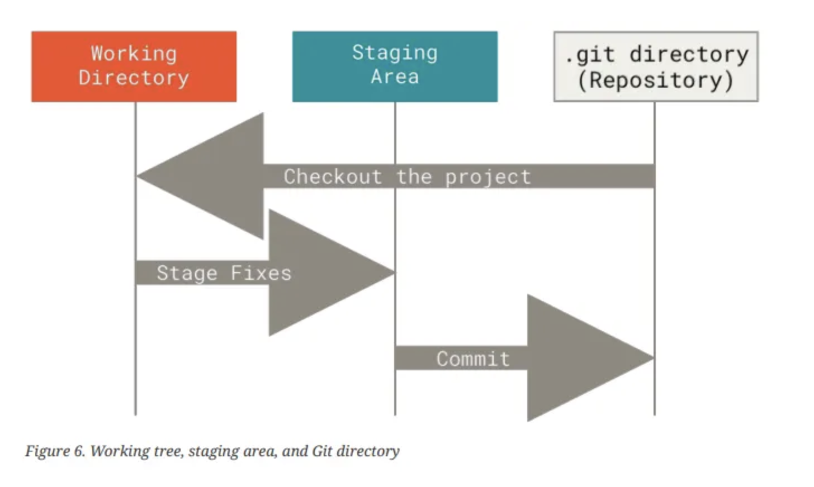

We can call the **working directory** the folder environment where our project is located.

We can think of the **staging area** (index) as the place where we keep our changes before moving them to the .git directory.

The **.git directory** is the folder where we move (commit) the changes we are sure of. Later, we will push these files to remote repositories, but that's not all.

As we said, Git is a version control system; to track who made which change, we need to configure Git's settings.


*Opening our command line.*

First of all, if Git is not installed on your computer, you need to download and install it from this link.

#### git config

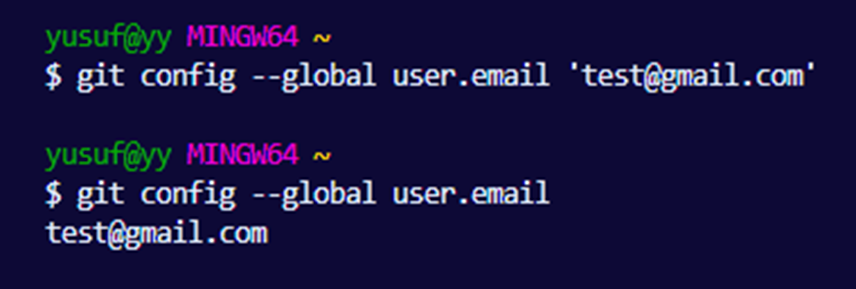

As seen above, we told Git our email address using git config. We need to do the same for the name variable.

```
git config — global user.name 'yourname'
```

#### git init

This command signifies that the current folder can now be tracked by Git. It creates a hidden empty folder named .git inside the directory (.git directory).

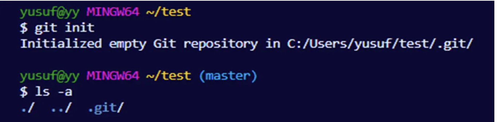

*We used ls –a to see all hidden and open content in the directory; the .git/ folder appeared.*

#### git add \<filename\>

With this command, we save the changes we made in the Working Directory (WD) to the Staging Area (SA/index).

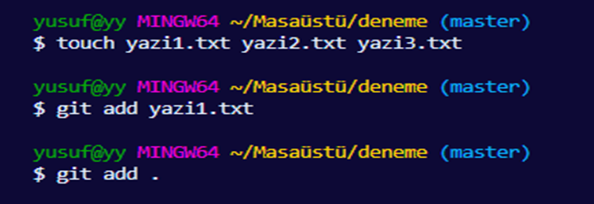

We created 3 .txt files using the touch command. To save them to the index, we could add them one by one or all at once using 'git add .' as seen in the last line. Note that Git is case-sensitive.

#### .gitignore

This file provides vital functionality. It is used to prevent files and information that we don't want to upload to remote servers—such as API keys or node_modules—from being pushed. We need to create a file named .gitignore in our project and write the names of the files we don't want to be uploaded inside it.

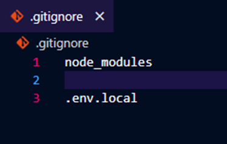

*Git no longer has a relationship with these files.*

#### git status

With this command, we get information about the status of our changes in the staging area.

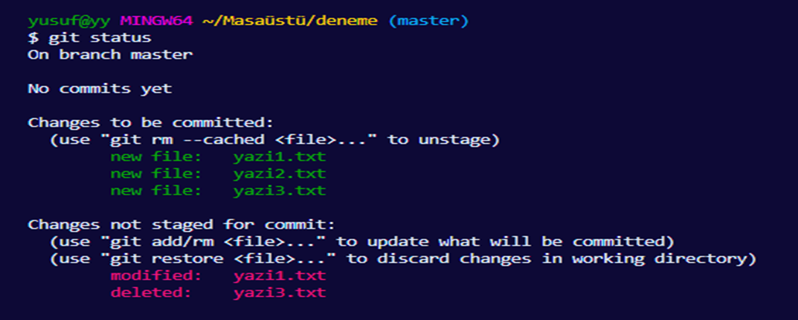

As seen, I added 3 new files to the index, deleted one, and modified another. Two suggestions appear in the descriptions above:

1. git rm — -cached \<file\>
   Using this command, we can unstage a file we no longer want to track. We can use git add again if we wish.
2. git restore \<file\>
   Using this command, we can revert the changes made to a staged file back to its state in the last commit.

#### git commit

We moved our files from WD to the index using git add. Now we will transfer these files to the local repo (.git directory) using git commit. This process is called committing.

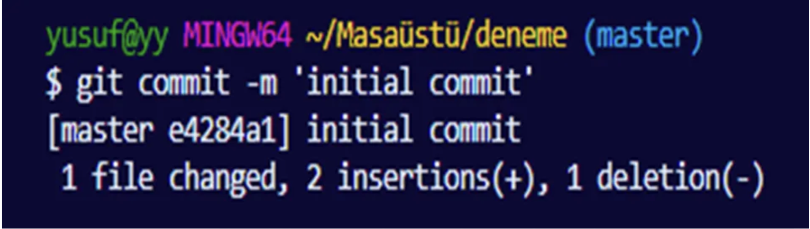

We add a message feature to our commit using -m.

#### git log

With this command, we can access our commit history.

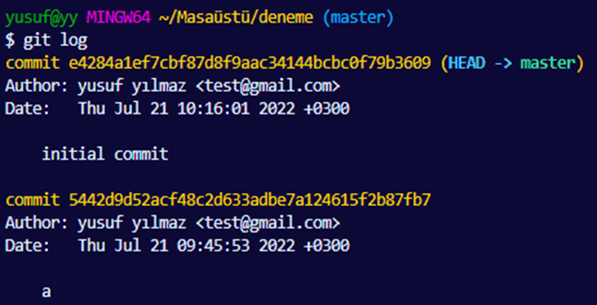

*The message we wrote during the commit process appears here.*

As seen, we get information about the commit date and the person who made the commit along with the commit message. We encounter 3 different concepts above:

- **Hashcode:** Every commit has a unique hash value, and we use these hashes in Git commands like diff, checkout, revert, reset, etc.
- **Head:** Shows where we are. It generally points to the last commit. That is, your latest change is highlighted with the Head label.
- **Branch:** We can think of branches as different working folders. Multiple branches can be created in every project to develop different structures and merge them at the appropriate time (without conflicts).

#### git branch

You can view existing branches with this command.

```
git branch <branchname>
```

You can create a new branch with this command.

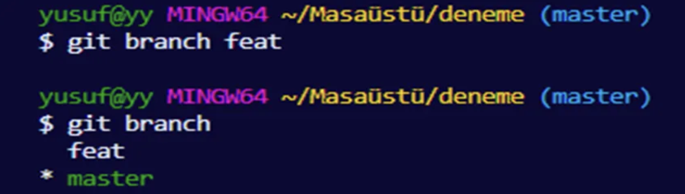

#### git switch \<branchname\>

You can switch between branches with this command.

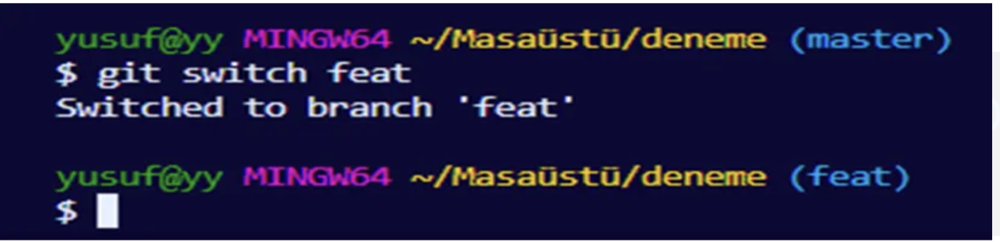

#### git branch -d \<branchname\>

You can delete a branch you created with this command.

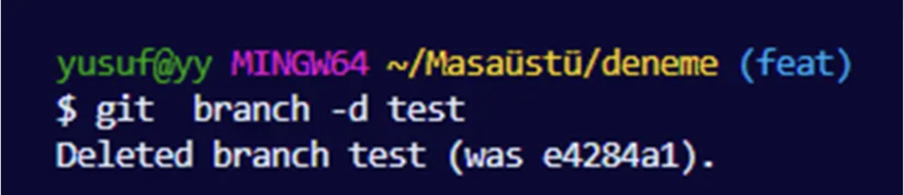

Since we often work with multiple team members, we work on different branches. When we want to merge these branches with the project's main branch, we use the git merge feature. We must act very carefully at this point because conflicts can ruin the project.

**What could these conflicts be?**
For example; if we modify a file in the 'feat' branch that was opened in the 'master' branch, but delete that same file in 'master', it creates a conflict. Git cannot perform the automatic merge here. We can fix this conflict by making a new commit.

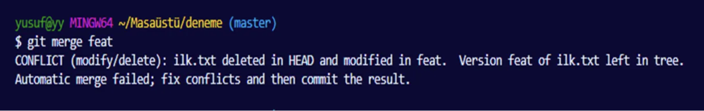

#### git merge

Used to combine two branches. If there is no conflict, the merge process succeeds.


*Each letter represents a commit and each line represents a branch.*

If we run 'git merge feat' while on the master branch, our feat branch merges with master and reaches the state below.


*A merge commit named 'h' was created.*

#### Fast Forward

If we create a new branch and continue committing there while no changes are made to the master branch, merging these branches will result in "fast forwarding" since they can combine without any conflicts.


#### git stash

This command is used to prevent losing changes when:
We are not ready to commit,
We have to switch branches, or
We don't want to save the changes yet.
The changes are stored in a memory area called 'stash'.

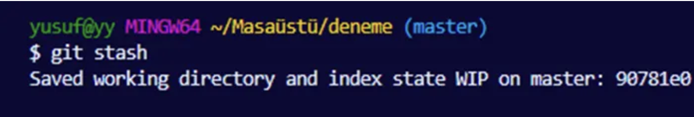

#### git stash pop

Used to bring back the changes we added to the stash.

#### git stash list

With this command, we can access all our records in the stash.

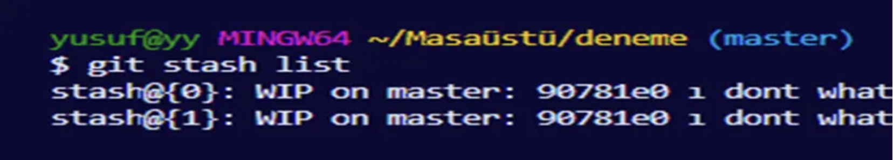

#### git stash apply

With this command, we can apply all our stash records, or we can add them one by one by adding the stash ID to the end of the command.

#### git stash clear

With this command, we can clear all our records in the stash.

#### git checkout \<hashcode\>

We previously learned how to go back on operations with git add. This time we will see how to go back to commits. This command allows us to return to previous commits.

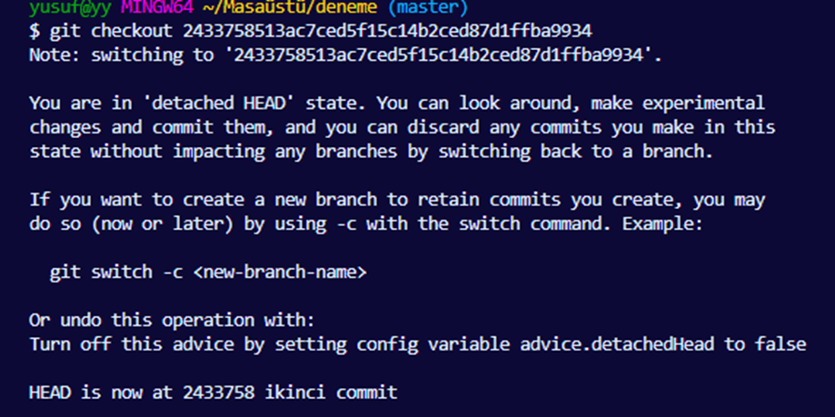

We wrote the hash of the commit we wanted to return to next to checkout, and the Head status changed. Git tells us this is a "detached Head" state and asks us to fix it.

#### Detached Head

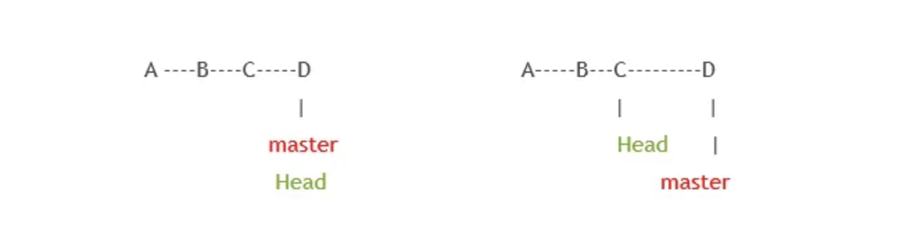

As seen in the figure above, if we return to commit C, our Head will point to C, but commit D is still our last commit.

In this case, there are 2 things we can do to get out of DH:

1. We can fix this by returning to master (git switch master).
2. We can open a new branch and continue from there.


*branch feat > git switch feat > git add . > git commit*

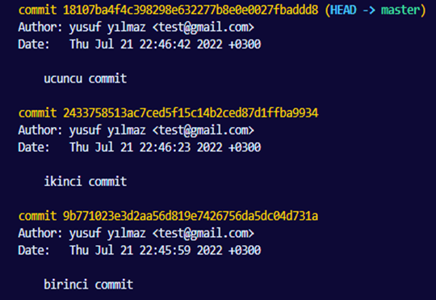

*This log record should be followed to go back in commit processes.*

#### git reset \<hashcode\>

I am currently at the 3rd commit and I want to go back to the 2nd. In this case, by writing 'git reset [2nd commit hash]', I delete the commits after the second one from the log.

But the changes I made will still remain saved in my file. If I want to delete both states, I need to run my code as: git reset –-hard \<hashcode\>.


*Returned to commit B.*

#### git revert \<hashcode\>

I want to undo the 3rd commit but I don't want to interfere with the commit log and I want to continue from the same branch. In this case, by writing 'git revert [3rd commit hash]', we go back and complete this with a new commit.

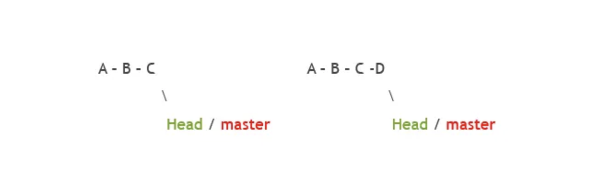

*I reverted commit C, but the record for commit C was not deleted, and a new commit was created stating that I performed a revert.*

#### git diff

It is used to view answers to questions such as:
What did we change between which commits?
What happened between which commits?
What happened between which branches?
What were the differences between the working directory and staging area?

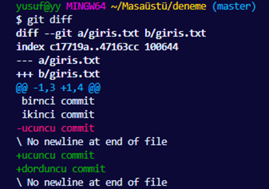

*Lines with — represent removals, while + represents additions.*

We can also see the difference between commits by running 'git diff 1.hash 2.hash ...'.

With 'git diff Head', we can see what we changed compared to the last commit.

#### git rebase

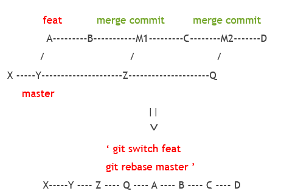

A command used to get rid of merge commits. Our repo looks like the example above.

Now let's go to GitHub (or whichever app you use) and create a new repo there.

We need to give our project a name and determine the visibility level. There are 2 options: Public and Private. As the name suggests, Public ones can be viewed by all Internet users. Private ones can only be viewed by us and the people we grant permission to.

Also, while creating the project, it asks if we want to add a README.md file; this file contains descriptions of the project.

#### git remote

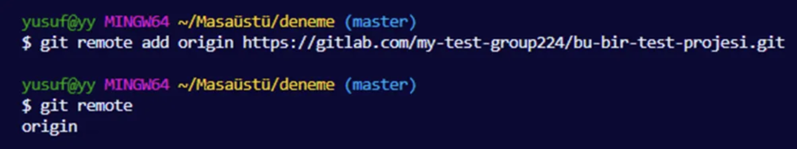

Using the 'git remote add origin \<remoteUrl\>' command, we can now add our local branches and changes to a repo on a remote server, or bring changes from there to local.

Here, the word 'origin' is an alias, meaning a nickname that represents our URL. It is used in push and pull operations. We could use a different word instead of 'origin', but we use it because it is more common.

#### git push origin \<branchname\>

This process allows us to transfer our commits in the local repo to the remote repo.

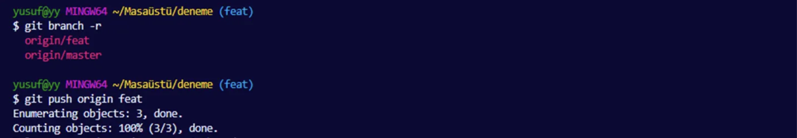

*By doing 'git push origin feat', we have now transferred all our changes to the feat branch on the remote.*

We can see branches on remote with 'git branch –r'.

#### Pull Request

As a developer, we made changes in our own branch and we want it to be merged with the main branch of the product. We make a request to the admin of the main branch by opening a Pull Request on GitHub or a Merge Request on GitLab. If the admin wishes, they can review the code and merge it or close the PR.

Let's assume the PR is approved by the admin.

#### git pull / fetch

Since we performed this operation on remote, our local Git operations are behind the remote. In this case, our remote repo will be ahead of our local repo. We need to use pull and fetch commands to synchronize them.

**Fetch:** Brings changes to local and allows us to view them.

**Pull:** Both brings these changes to local and performs the merge process.

#### git fetch

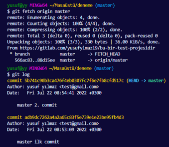

When I say 'git fetch origin master', the changes arrive, but when I look at the git log, I see that the Merge commit is not there. If I go to the origin master branch on remote, I can view them.

Let's go.

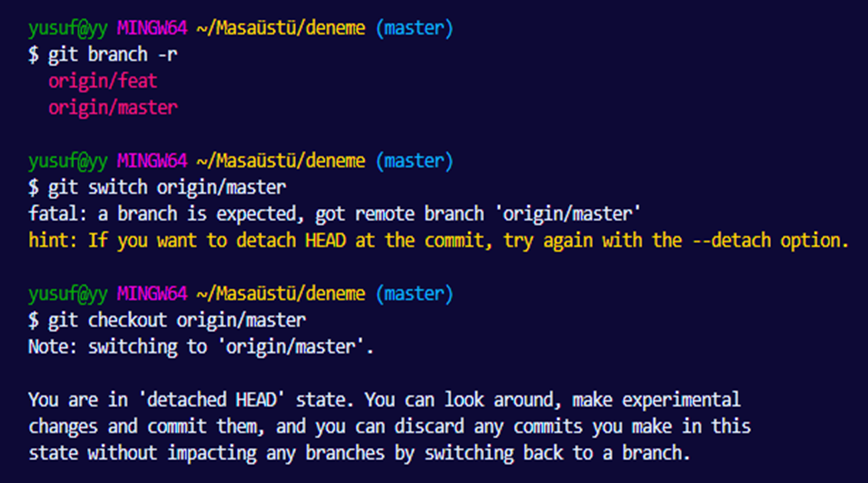

First, we check our remote branches. When we do 'git switch origin/master', it tells us this is a remote branch. Now we learn the new use of checkout; we need to switch to remote branches with checkout.

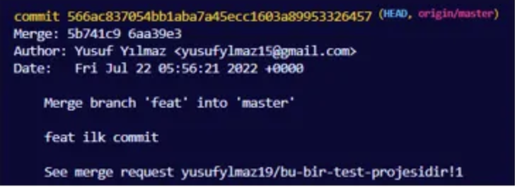

*We can view the merge commit by doing git log.*

#### git pull

git pull = git fetch + git merge, so it brings all changes completely to local. The reason we use fetch is for checking purposes to see if there is an issue.

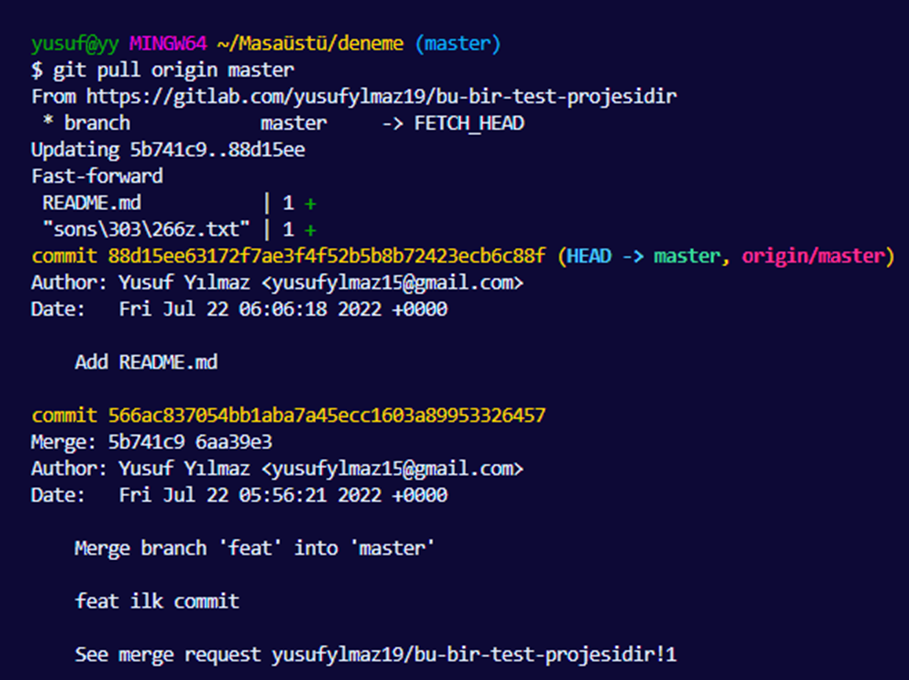

As seen above, with the pull process, changes on remote arrived and it is now synchronized with GitLab and our local.

#### git pull — prune

Let's assume the branch we merged in the PR process was deleted as an option.

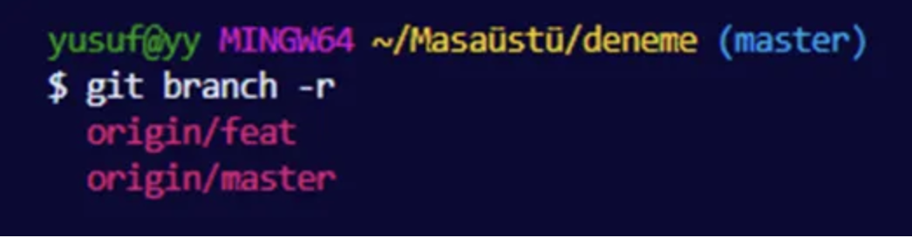

*When we do 'git branch –r', the origin/feat branch still appears.*

We can delete this with 'git branch –d'. Or we can automatically eliminate redundant branches by using the 'prune' keyword while performing the pull process.

#### git clone

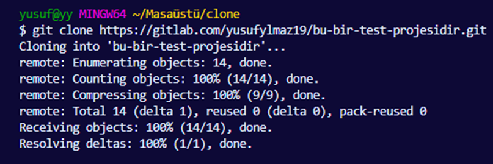

We browsed GitHub and liked a project; we want to bring it to our local. Or there is a repo we work on together; it is used to pull these projects to local.

We ran the command as 'git clone url', and now the project is in our local; we can enter the project with 'cd'. If we have permission, we can make commits to this project.

#### Fork

We liked the project. We want to make changes but we don't have permission. In this case, to make a new commit, we can fork the project and save it to our own repo. After pressing the Fork button, the project is now in our repo.

We can bring it to local with 'git clone' and make new commits. To show the new commits to the project owner, we can make pull/merge requests. In this way, we contribute to the project through a longer path.

#### Issues

Issues can be bugs we found, new ideas, or discussions. We can start this by opening it from the issues section of the project on GitHub or GitLab.

You can find more detailed information from the references used while preparing this article below.

Thanks for reading.

#### References

- [BTK Academy - Version Controls: Git and GitHub](https://www.btkakademi.gov.tr)
- [Pro Git Book (git-scm.com)](https://git-scm.com/book/en/v2)

`Git` `GitHub` `GitLab` `Version Control`
