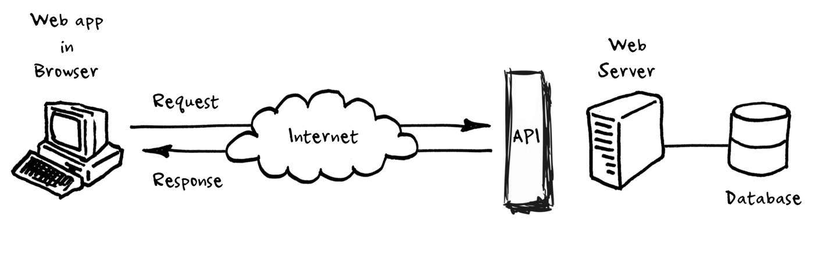

## Using the TMDB API


**Yusuf Yılmaz**

4 min read · Apr 5, 2022

Hello! In this post, we will design a web page together that lists popular movies by using an API.
First, let's briefly look at what an API is.



### What is an API?

An API allows two applications to exchange data and communicate with each other. It enables the functionality of one application to be used by other applications.
Think of the weather app on your phone. The weather app communicates with the server of the application that provides this data and displays the information within the app. This is what we call an API, but we will focus specifically on web-based APIs.
Web APIs return data in JSON or XML format. We design our applications using this returned data.

### Which API will we use?

In this post, we will use a movie API, but you might want to use different APIs. You can access many categorized APIs from this GitHub link. We will be using the TMDB API.
While some APIs do not require a key, others might. The one we are using requires an API key.

### Getting a Key from TMDB API

To use the TMDB API, we first need to sign up at this link.
Then, click on Settings > API to request a key. You will be presented with two options: whether you need it as a developer or a professional. Select "Developer" and accept the terms. Finally, it will ask for information such as "Where?" and "Why?" you will use it. Fill in the required details and...


...now we have a key! We can develop our application using the data provided by TMDB. You can see how to access specific data from the link provided there.

### Now, the Design

```html
<!DOCTYPE html>
<html lang="en">
 <head>
 <meta charset="UTF-8" />
 <meta http-equiv="X-UA-Compatible" content="IE=edge" />
 <meta name="viewport" content="width=device-width, initial-scale=1.0" />
 <title>my movie web site</title>
<link rel="stylesheet" href="pop.css" />
 <link
 rel="stylesheet"
 href="https://cdnjs.cloudflare.com/ajax/libs/font-awesome/6.1.0/css/all.min.css" /></head>
<body>
 <div class="control">
 <button id="previous"><i class="fa-solid fa-angles-left"></i></button>
 <div class="images"> 
 </div>
 <button id="next"><i class="fa-solid fa-angles-right"></i></button>
 </div>
 <div id="movie-details" class="movie-details hide">
 </div> 
<script src="pop.js"></script>
 </body>
</html>
```

The data we fetch will be placed inside the div with the "images" class.

### JavaScript Code

Now, let's write our API key and the necessary URLs in the JS file:

```javascript
let page = 1;
const APIKEY = "your_api_key_here";
// URL to access popular movies
const URL = `https://api.themoviedb.org/3/movie/popular?api_key=${APIKEY}&language=en-US&page=${page}`;
// Additional URL required to display movie posters
const IMGPATH = `https://image.tmdb.org/t/p/w1280/`;
```

Let's add the HTML tags and pagination logic:

```javascript
// HTML elements to manipulate
const images = document.querySelector(".images");
const nextBtn = document.getElementById("next");
const previousBtn = document.getElementById("previous");

// next page button
nextBtn.addEventListener("click", () => {
  images.innerHTML = "";
  page++;
  if (page > 500) {
    page = 1;
  }
  const URL = `https://api.themoviedb.org/3/movie/popular?api_key=${APIKEY}&language=en-US&page=${page}`;
  getPopMovies(URL);
});

// previous page button
previousBtn.addEventListener("click", () => {
  images.innerHTML = "";
  page--;
  if (page < 1) {
    page = 500;
  }
  const URL = `https://api.themoviedb.org/3/movie/popular?api_key=${APIKEY}&language=en-US&page=${page}`;
  getPopMovies(URL);
});
```

### Fetching the URL

```javascript
// getting popular movies from API
const getPopMovies = (url) => {
  fetch(url)
    .then(res => res.json())
    .then(data => {
      showMovies(data);
    })
};
```

As seen above, we passed our URL into the `fetch()` command. The `fetch()` method starts the process of fetching a resource from the network, returning a promise that is fulfilled once the response is available. Since the initial promise is not in JSON format, we convert it to JSON using the `json()` command. The `json()` method returns a second promise. We handle these processes using the `then()` command, which allows us to handle whether the promise was successful (resolve) or not (reject). If the second promise is also successful, we pass the movies as a parameter to the `showMovies()` function to display them on the screen.

```javascript
// showing movies on body
const showMovies = (data) => {
  if (data.results !== null) {
    data.results.forEach((e) => {
      const { title: t, poster_path: p, vote_average: v, release_date: d, id: i } = e;
      let box = document.createElement("div");
      box.classList.add("box");
      box.innerHTML = `
        <h1 id="title">${t}</h1>
        <button class="savelater"><i class="fa-solid fa-bookmark"></i></button>
        
        <div class="info">
          <h3>${d.slice(0, 4)}</h3>
          <h3>${v}</h3>
        </div>
        <button class="details up"><i class="fa-solid fa-angles-up"></i></button>
      `;
      images.appendChild(box);
    });
  }
};
```

First, we check if the `results` property of the `data` parameter we received from `getPopMovies()` is null. We use a `forEach` loop to access the data within `data.results`. To access the data more easily, we use Object Destructuring to get the movie's poster, title, rating, and release date. We add this data into the div we created using `innerHTML`. Finally, we add these HTML snippets into the previously mentioned "images" container by using `images.appendChild(box)`. Now, let's beautify our code with some CSS and look at the final version.

Sugar, spice and everything nice!


Here is the final state of our site:


Adding features like Search or Genre filtering to make it more effective is up to you! :) Thank you for joining me in this post, and have a great day.

#### References

- [MDN Web Docs](https://developer.mozilla.org/en-US/)
- [TMDB API Documentation](https://www.themoviedb.org/documentation/api)

`JavaScript` `JSON` `API` `TMDB` `Movies` `Fetch`
